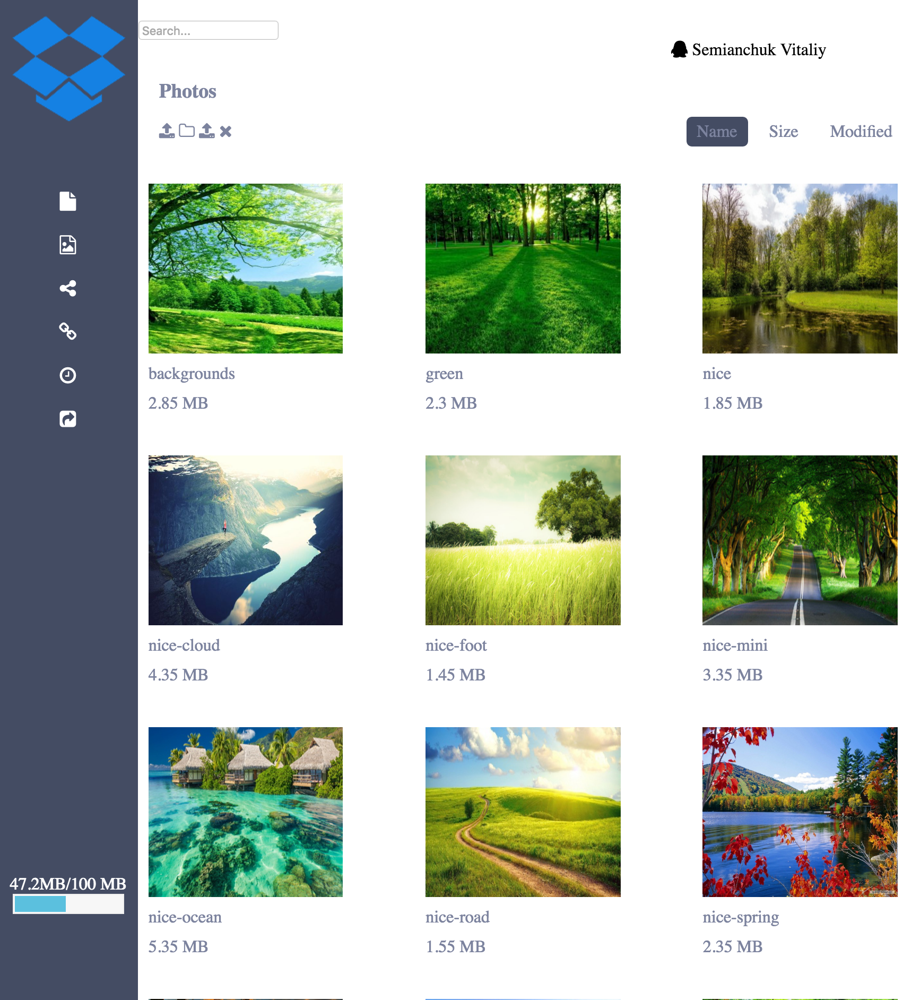

# Drop-box

## For quick install
```bash
npm install
gulp dev
npm start
```

## 1. Setup
```bash
npm install
```
- install dependencies

## 2. Watch files
```bash
gulp dev
```
- all SCSS/HTML will be watched for changes and injected into browser thanks to BrowserSync

## 3. Build production version
```bash
gulp build
```
## 4. Start webserver
```bash
npm start
```
## Structure of App
```
app.js
index.html
public/
    JSON/ (simulate a back-end database of images)
    lib/
    ico/
    styles/
    template/
src/
    _config/
    modules/
        header/
            .html
            .js
            .scss
        main/
            controller/
            directive/
            factory/
            service/
            .html
            .js
            .scss
        navbar/
            factory/
            .html
            .js
            .scss
```
## first size


## second size



## Contact
Copyright (C) 2016 Semianchuk Vitalii<br>
[www.github.com/fix2015](http://www.github.com/fix2015)<br>
